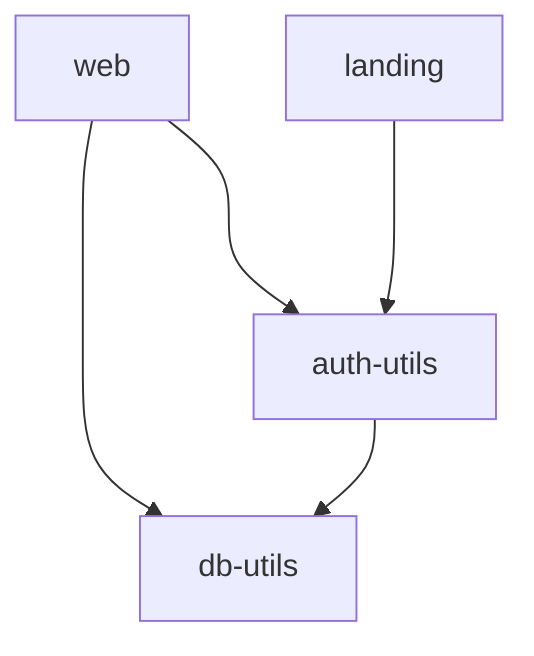

# Lucia authentication in monorepo starter pack
Opionated minimal implementation of shared auth between multiple packages.
Made for article – [Authentication in monorepo(NextJs, Astro) with Lucia and MongoDB](https://dev.to/skorphil/authentication-in-monoreponextjs-astro-with-lucia-and-mongodb-16d7)

## Project overview
- `mysite.com` – landing page built with Astro
Publicly available
Provides login/signup page
Redirects authenticated users to `app.mysite.com`
- `app.mysite.com` – web application built with NextJs (app Router)
Available only for authenticated users
Provides sign-out feature
Redirects unauthenticated users to `mysite.com`

### Stack
- Astro
- NextJs (app router)
- Lucia-auth
- Mongoose
- TurboRepo
- npm
- dotenv

### Monorepo structure

- `db-utils` - provide simple db methods to work with MongoDb. `CreateUser`, `GetUser`. These methods are used by `auth-utils`.
- `auth-utils` - provide methods to create users and user sessions. Used by `web` and `landing`
- `web` - web application, accessible only for authenticated users. Provides log-out function
- `landing` - public landing page. Provides logout and login form. Inaccessible for authenticated users